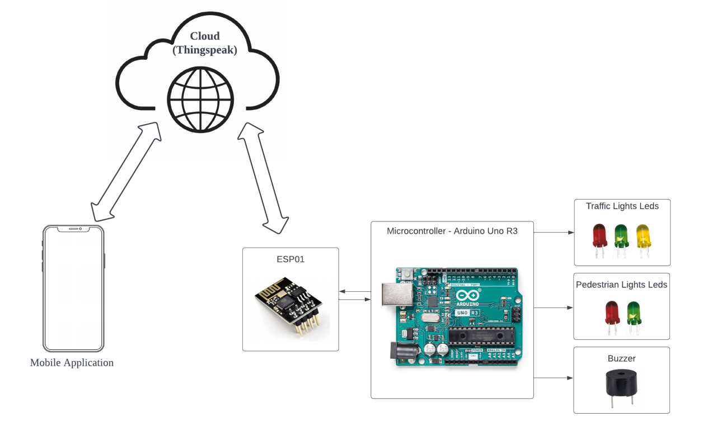

# Preemptive Traffic Light Mini-Project

## Overview
This project aims to develop a mobile application to facilitate faster emergency response times by preemptively changing traffic lights to green for approaching ambulances.

## Solution
The mobile app allows ambulances to control traffic lights, ensuring they turn green faster or stay green longer, thereby creating a clear path and reducing response times.

## Components
1. **Arduino**: Used to control the traffic light signals.
2. **MIT App Inventor**: Utilized to develop the mobile application for the ambulance.
3. **ThingSpeak**: Acts as the IoT platform to manage the communication between the mobile app and the Arduino-controlled traffic lights.

## Features
- Real-time communication between ambulance and traffic lights.
- Ability to change traffic lights to green faster or keep them green longer.
- Integration with IoT platforms for seamless data exchange.

## Installation
1. **Arduino Setup**:
    - Connect the Arduino to the traffic light system.
    - Upload the control program to the Arduino.

2. **Mobile App**:
    - Download and install the app created with MIT App Inventor.
    - Configure the app with the necessary API keys from ThingSpeak.

3. **ThingSpeak Configuration**:
    - Set up a ThingSpeak channel for data exchange.
    - Obtain the API keys and configure the Arduino and mobile app.

## Usage
1. **Launch the Mobile App**:
    - Open the app on the a phone.
    - Enter the destination and initiate the traffic control system.

